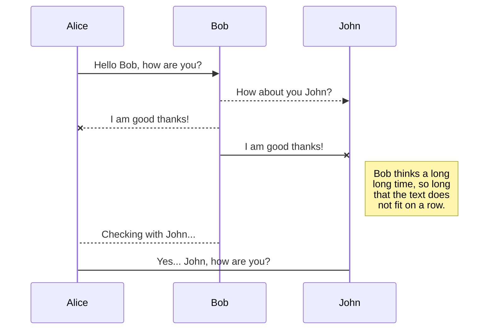

# rsync

> #### *Rsync, which stands for remote sync, is a remote and local file synchronization tool. It uses an algorithm to minimize the amount of data copied by only moving the portions of files that have changed.*

## Basic Usage

To copy the source to the destination

```bash
rsync [source] [destination]
```

### Important Subtleties: the Trailing Slash

You can simply specify a file, this wouldn't have a trailing slash. But what about folders? What would that do?

Lets assume that both `source` and `dest` are folders.

```bash
# No trailing slashes
rsync path/to/source path/to/dest

# trailing slash on source
rsync path/to/source/ path/to/dest

# Trailing slash on destination
rsync path/to/source path/to/dest/

# Trailing slash on both ysour workspace on any other device.
	> To start syncing your workspace, just sign in with Google in the menu.

- The file synchronization will keep one filce and destination
rsync path/to/source/ path/to/dest/
```

## Working Remotely 

## Some of the wMorkspace synced with one or multiple files in **Google Drive**, **Dropbox** or **GitHub**.
	> Before starting to sync files, you must link an account in the **Synchronize** sub-menu.

## Open a file

You can open a file from **Google Drive**, **Dropbox** or **GitHub** by opening the **Synchronize** sub-menu and clicking **Open from**. Once opened in the workspace, any modification in the file will be automatically synced.

## Save a file

You can save any file of the workspace to **Google Drive**, **Dropbox** or **GitHub** by opening the **Synchronize** sub-menu and clicking **Save on**. Even if a file in the workspace is already synced, you can save it to another location. StackEdit can sync one file with multiple locations and accoune Useful Options

```bash
# Info
--verbose, -v            increase verbosity
--human-readable, -h     output numbers in a human-readable format
--progress               show progress during transfer
--stats                  give some file-transfer stats.

## Synchronize a file

Once your file is linked to a synchronized location, StackEdit will periodically synchronize it by downloading/uploading any modification. A merge will be performed if necessary and conflicts will be resolved.

If you just have modified your file and you want to force syncing, click the **Synchronize now** button in the navigation bar.

> **Note:** The **Synchronize now** button is disabled if you have no file to synchronize.

## Manage file synchronization

Since one file can be synced with multiple locations, you can list and manage synchronized locations by clicking **File synchronization** in the **Synchronize** sub-menu. This allows you to list and remove synchronized locations that are linked to your file.


# Publication

Publishing in StackEdit makes it simple for you to publish online your files. Once you're happy with a file, you can publish it to different hosting platforms like **Blogger**, **Dropbox**, **Gist**, **GitHub**, **Google Drive**, **WordPress** and **Zendesk**. With [Handlebars templates](http://handlebarsjs.com/), you have full control over what you export.

> Before starting to publish, you must link an account in the **Publish** sub-menu.

## Publish a File

You can publish your file by opening the **Publish** sub-menu and by clicking **Publish to**. For some locations, you can choose between the following formats:

- Markdown: publish the Markdown text on a website that can interpret it (**GitHub** for instance),
- HTML: publish the file converted to HTML via a Handlebars template (on a blog for example).

## Update a publication

After publishing, StackEdit keeps your file linked to that publication which makes it easy for you to re-publish it. Once you have modified your file and you want to update your publication, click on the **Publish now** button in the navigation bar.

> **Note:** The **Publish now** button is disabled if your file has not been published yet.

## Manage file publication

Since one file can be published to multiple locations, you can list and manage publish locations by clicking **File publication** in the **Publish** sub-menu. This allows you to list and remove publication locations that are linked to your file.


# Markdown extensions

StackEdit extends the standard Markdown syntax by adding extra **Markdown extensions**, providing you with some nice features.

> **ProTip:** You can disable any **Markdown extension** in the **File properties** dialog.


## SmartyPants

SmartyPants converts ASCII punctuation characters into "smart" typographic punctuation HTML entities. For example:

|                |ASCII                          |HTML                         |
|----------------|-------------------------------|-----------------------------|
|Singl Testing
--dry-run, -n            perform a trial run with no changes made
--list-only              list the files instead of copying them

# Directories
--recursive, -r          recurse into directories
--mkpath                 create the destination's path component

# Files
--archive, -a            archive mode; equals -rlptgoD (no -H,-A,-X)
--update, -u             skip files that are newer on the receiver
--append                 append data onto shorter files
--append-verify          --append w/old data in file checksum

# Meta Data
--perms, -p              preserve permissions
--executability, -E      preserve executability
--xattrs, -X             preserve extended attributes
--times, -t              preserve modification times
--atimes, -U             preserve backticks|`'Isn't this fun?'`            |'Isn't this fun?'            |
|Quotes          |`"Isn't this fun?"`            |"Isn't this fun?"            |
|Dashes          |`-- is en-dash, --- is em-dash`|-- is en-dash, --- is em-dash|


## KaTeX

You can render LaTeX mathematical expressions using [KaTeX](https://khan.github.io/KaTeX/):

The *Gamma function* satisfying $\Gamma(n) = (n-1)!\quad\forall n\in\mathbb N$ is via the Euler integral

$$
\Gamma(z) = \int_0^\infty t^{z-1}e^{-t}dt\,.
$$

> You can find more information about **LaTeX** mathematical expressions [here](http://meta.math.stackexchange.com/questions/5020/mathjax-basic-tutorial-and-quick-reference).


## UML diagrams

You can render UML diagrams using [Mermaid](https://mermaidjs.github.io/). For example, this will produce a sequence diagram:



And this will produce a flow chart:

```mermaid
graph LR
A[Square Rect] -- Link text --> B((Circle))
A --> C(Round Rect)
B --> D{Rhombus}
C --> D
```cess (use) times

# Symlinks
--links, -l              copy symlinks as symlinks
--hard-links, -H         preserve hard links
--copy-links, -L         transform symlink into referent file/dir
--safe-links             ignore symlinks that point outside the tree
```

## Advanced Usage


### Watching a folder recursively with `procmon`

Other options through choco are

#### Correcting Errors

##### Making sure rsync isn't running

## Remote Usage

## References / Sources

- https://www.digitalocean.com/community/tutorials/how-to-use-rsync-to-sync-local-and-remote-directories

